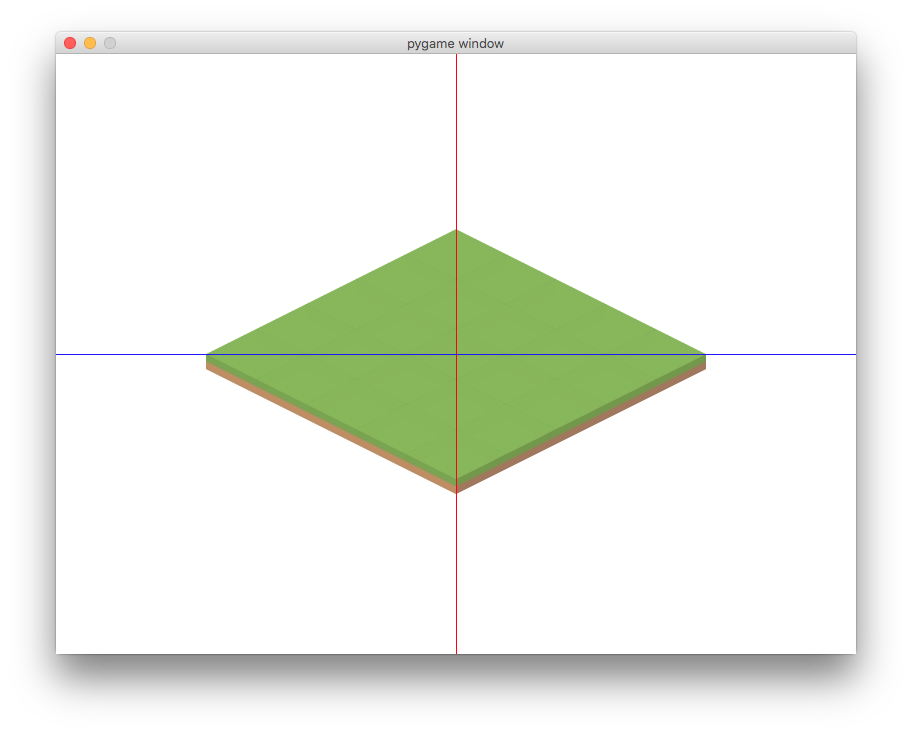
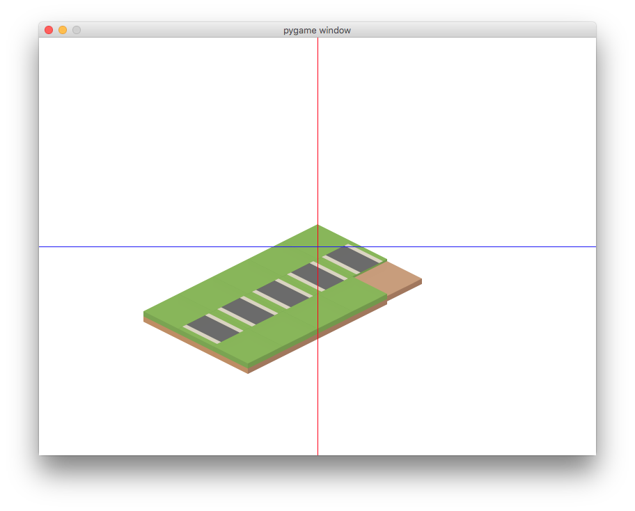

# Création d'un jeu en vue isométrique

## Principe de l'approche "tile-based"

Dans l'approche "tile-based", chaque élément visuel (personnage, décor, bâtiments...) est décomposé en briques élémentaires d'une taille fixée : les cases (_tiles_). On modélise ces cases sur une matrice 2D et on les utilise pour construire la représentation isométrique.

Chaque case peut être d'un type spécifique, comme on l'a déjà fait dans le tank game : herbe, mur, roche, sable ... On les encode par des numéros dans la matrice des cases.

Par ex on représente des murs par 1 et de l'herbe par 0 et on peut construire une map avec une matrice du type :

```
1 1 1 1 1
1 0 0 0 1
1 0 0 0 1
1 0 0 0 1
1 1 1 1 1
```

Concrètement dans Pygame, on va avoir à notre disposition une palette de cases (une sorte de bibliothèque à surfaces pré-chargées) que l'on va blitter sur la surface de l'écran.

La taille de chaque case étant choisie (ex: 50px*50px), le plus simple sera d'utiliser des images de base de la même taille (comme on l'a toujours fait).

## Projection isométrique

### Le principe

Il s'agit effectivement d'une **projection** : on passe d'une vue top-down (2D classique, cartésienne) à une vue isométrique. Pour cela, **la caméra pivote de 45°à gauche ou à droite** (les diagonales de la map forment un + au lieu d'un x) **puis de 30°vers le bas**. Ces angles sont choisis pour que les cases forment des **losanges 2x plus larges qu'ils ne sont hauts**.

> Conséquence importante : un `Rect(top, left, width, height)` a une largeur et hauteur isométrique de `(width, height/2)`. Donc les cases ont une taille cartésienne `(TILE_SIZE, TILE_SIZE)` et une taille isométrique `(TILE_SIZE, TILE_SIZE/2)`.

Ces angles étant donnés, on peut déterminer une relation directe entre les coordonnées cartésiennes `(x, y)` d'une case et ses coordonnées isométriques `(xi, yi)` (ces coordonnées étant en effet les coordonnées "à l'écran") :

```python
# Transformation des coordonnées d'une case
# cartésien -> isométrique
xi = x - y
yi = (x + y) / 2

# isométrique -> cartésien
x = (2*yi + xi) / 2
y = (2*yi - xi) / 2
```

On voit donc bien que ** $x$ peut varier de `- TILE_SIZE` à `+ TILE_SIZE`**, et qu'en revanche **$y$ varie entre `0` et `+ TILE_SIZE`**.

Par exemple, prenons une map carrée de 100 cases de côté et calculons les coordonnées isométriques de chaque coin :


| `(x, y)` | `(xi, yi)` |
|:----------:|:----------:|
|`(0, 0)`| `(0, 0)`|
|`(100, 0)`|`(100, 50)`|
|`(0, 100)`|`(-100, -50)`|
|`(100, 100)`|`(0, 100)`|

### Premiers tests

Ça donne quelque chose comme ça sur une map rentrée à la main.



Les lignes rouges et bleues indiquent juste le centre de l'écran. La position initiale d'une map carrée comme celle-ci a pu changer avec les nouvelles versions de l'affichage.

### Bibliothèque de cases (Tile, TileLibrary)

Màj (le 11/08/2016)

Le dossier d'images de cases est situé `static/img/tiles`. Chaque catégorie de cases est un sous-dossier du dossier `tiles`.

Le fichier `tileslibrary` construit automatiquement autant de dictionnaires de tiles qu'il y a de sous-dossiers dans le dossier `tiles`. Chaque dictionnaire est un attribut de l'objet `tlib`. Ce qui est stocké dans ces dictionnaire est une association entre le nom de la tile et le couple (image, rect) associé qui a été pré-chargé.

Par exemple, pour obtenir l'image et le rect de la case "grass" (qui est de la catégorie "terrain"), on utilise : `tlib.terrain_tiles["grass"]`. Et pour utiliser le `tlib` dans un module, on écrit `from .tileslibrary import tlib`.

On a ainsi construit la classe `Tile` qui dérive de `IsoSprite`, en récupérant le `image` et le `rect` depuis la `tlib`.

### Système de maps

Pour pouvoir tester l'isométrique, j'ai implémenté un mini-système de maps.

Un fichier de map est un fichier d'extension `.map`. Chaque fichier `.map` doit être construit de la même manière :

```python
WIDTH
"""donner la largeur de la map (nombre entier)"""
# exemple :
3
HEIGHT
"""donner la largeur de la map (nombre entier)"""
# exemple :
5

TILE_TYPES
"""indiquer les types de cases utilisées comme suit :
<symbole> <catégorie> <tile_type>"""
# exemple :
0 terrain grass
1 terrain roadNorth
2 terrain dirt
END  # terminer par END

TILES_ARRAY
"""indiquer la map sous forme matricielle en utilisant
les symboles"""
# exemple :
012
010
010
010
010
END  # terminer par END

END_OF_FILE  # termine le fichier .map
```

Actuellement, voici les conventions de la rose des vents :

- le nord est en haut sur la `TILES_ARRAY`
- le nord est vers le coin supérieur droit sur le rendu isométrique

Voici ce que donne l'exemple ci-dessus (on peut y avoir la correspondance des directions entre `TILES_ARRAY` et la vue isométrique).



### Isometric depth sorting (IDS)

ça arrive !